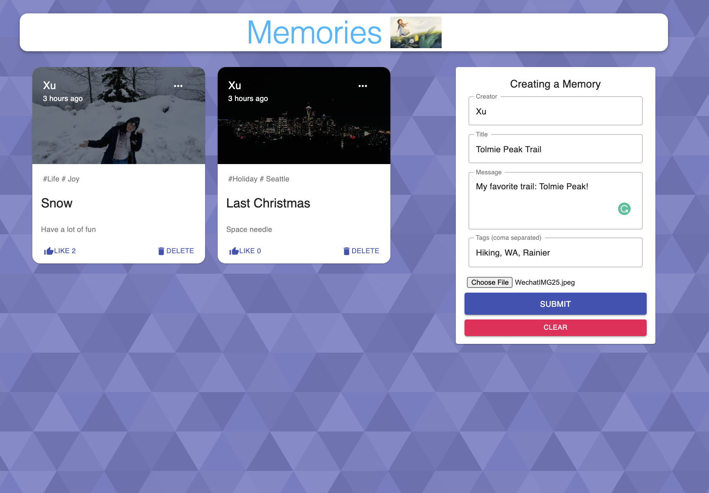
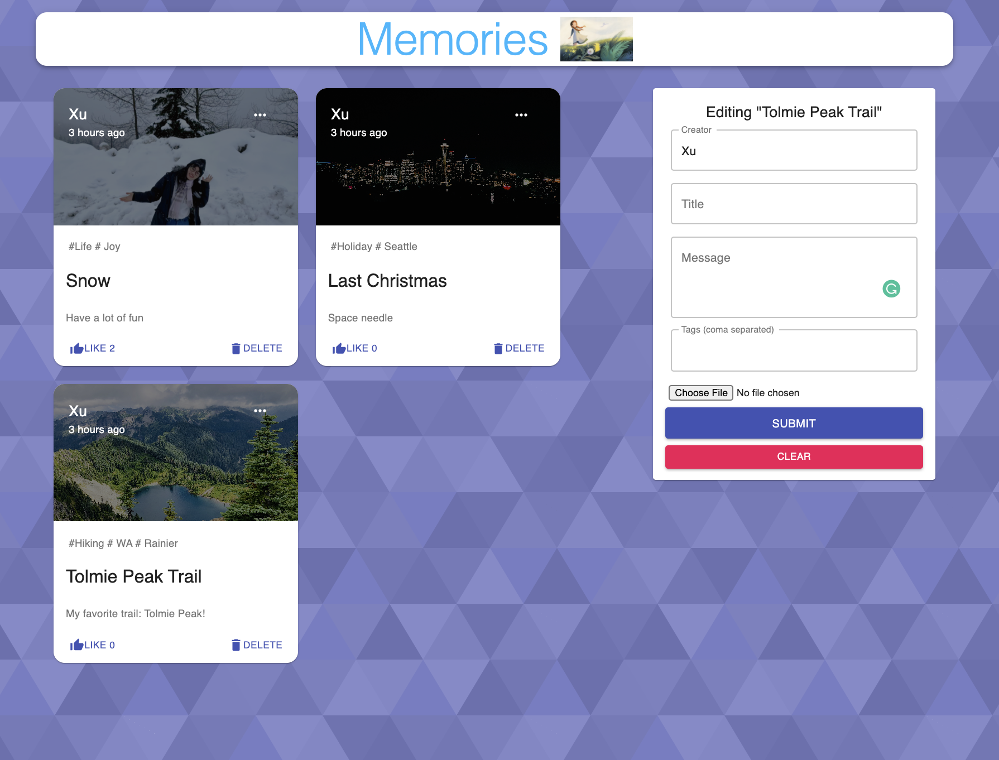

# Memories

A social media MERN application that allows you to post interesting events that happened in your life!

## User Stories

The following functionalities are completed:

- [ ✔ ] User can create a post with **creator, title, message, tags, and a picture from local** .
- [ ✔ ] User can edit existing posts.
- [ ✔ ] User can delete an existing post. 
- [ ✔ ] User can react to a post by like button, the counter will increse.

## Tech Stack

- MongoDB - document database
- Express(.js) - Node.js web framework
- React(.js) - a client-side JavaScript framework
- Node(.js) - the premier JavaScript web server

  

## Walkthrough

  

  

